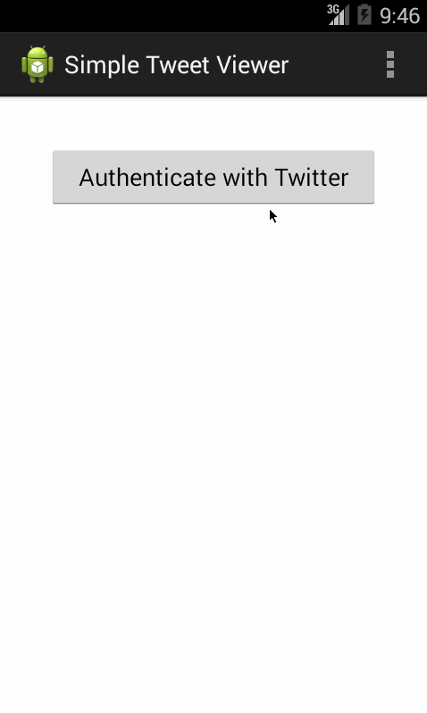

SimpleTweetViewer
====
## Overview
A simple Twitter client that supports viewing a Twitter timeline and composing a new tweet.
Week 4 & 5 Project for Codepath Intro to Android.

Time Spent: 16 hours

## User Stories

### Mandatory
#### Week 4
1. [X] User can sign in using OAuth login flow
2. [X] User can view last 25 tweets from their home timeline 
    [X] User should be able to see the user, body and timestamp for tweet 
    [X] User should be displayed the relative timestamp for a tweet "8m", "7h" 
    [X] __OPTIONAL__: Links in tweets are clickable and viewable 
3. [X] User can load more tweets once they reach the bottom of the list using "infinite scroll" pagination 
4. [X] User can compose a new tweet 
    [X] User can click a "Compose" icon in the Action Bar on the top right 
    [X] User will have a Compose view opened 
    [X] User can enter a message and hit a button to post to twitter 
    [X] User should be taken back to home timeline with new tweet visible 
    [ ] __OPTIONAL__: User can see a counter with total number of characters left for tweet 

#### Week 5
1. [X] User can switch between Timeline and Mention views using tabs. 
    a. [X] User can view their home timeline tweets. 
    b. [X] User can view the recent mentions of their username. 
    c. [X] User can scroll to bottom of either of these lists and new tweets will load ("infinite scroll") 
    d. [X] __OPTIONAL__: Implement this in a gingerbread-compatible approach 
2. [X] User can navigate to view their own profile. 
    a. [X] User can see picture, tagline, # of followers, # of following, and tweets on their profile. 
3. [X] User can click on the profile image in any tweet to see another user's profile. 
    a. [X] User can see picture, tagline, # of followers, # of following, and tweets of clicked user. 
    b. [X] Profile view should include that user's timeline. 
    c. [ ] __OPTIONAL__: User can view following / followers list through the profile 

### Optional
#### Week 4
5. [X] User can refresh tweets timeline by pulling down to refresh (i.e pull-to-refresh) 
6. [ ] User can open the twitter app offline and see last loaded tweets 
    a. [ ] Tweets are persisted into sqlite and can be displayed from the local DB 
7. [ ] User can tap a tweet to display a "detailed" view of that tweet 
8. [ ] User can select "reply" from detail view to respond to a tweet 
9. [ ] Improve the user interface and theme the app to feel twitter branded 
10. [ ] User can see an embedded media (image) within tweet detail view 
11. [ ] Compose View activity is replaced with a modal overlay 

#### Week 5
4. [X] When a network request goes out, user sees an indeterminate progress indicator 
5. [X] User can "reply" to any tweet on their home timeline 
    a. [ ] The user that wrote the original tweet is automatically "@" replied in compose 
6. [ ] User can click on a tweet to be taken to a "detail view" of that tweet 
    a. [ ] User can take favorite (and unfavorite) or reweet actions on a tweet 
7. [ ] Improve the user interface and theme the app to feel twitter branded 
8. [ ] User can search for tweets matching a particular query and see results 
8. [ ] __STRETCH__: User can view their direct messages (or send new ones) 

## Walkthroughs

GIFs created by LiceCap <http://www.cockos.com/licecap/>
